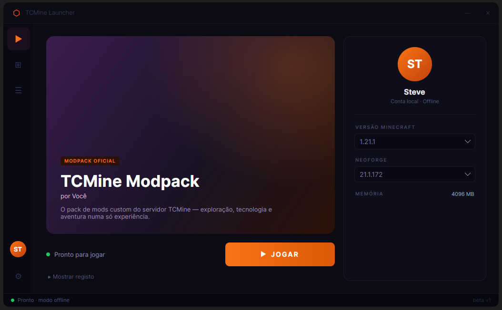
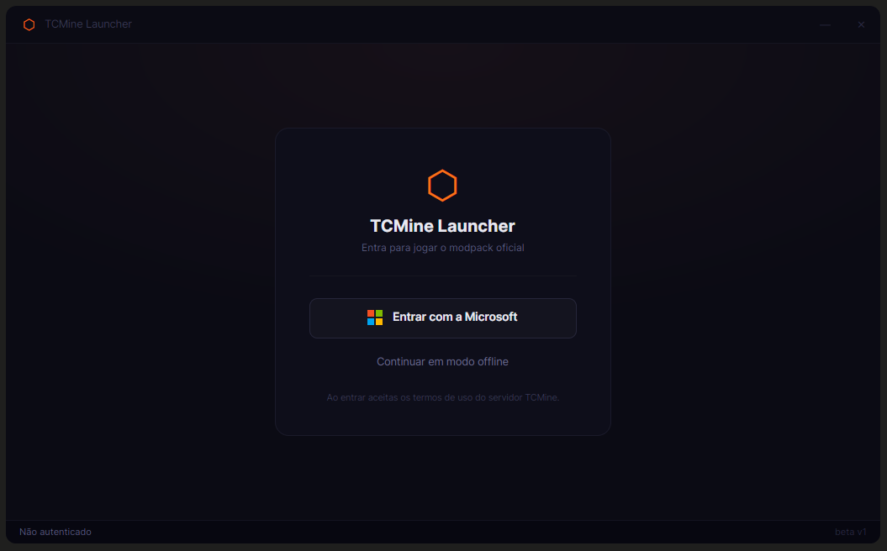

<div align="center">

# 🎮 TCMine Launcher

**Launcher de Minecraft personalizado para o servidor e o modpack NeoForge do TCMine.**

Login com a Microsoft, gestão de versões e um modpack próprio — tudo numa interface moderna.


</div>

---

## ✨ Visão geral

O **TCMine Launcher** é um launcher desktop construído com **Avalonia UI** (.NET 10) que instala e lança
**modpacks NeoForge** a partir de um **servidor configurável** (o TCMine por omissão, mas podes apontar para o teu
em Definições). Foca-se numa experiência simples: entra com a tua conta Microsoft, escolhe o modpack e joga —
com instâncias isoladas, auto-update e conteúdo gerido pelo servidor.

<div align="center">



</div>

## 🚀 Funcionalidades

- 🔐 **Login com a Microsoft** (navegador do sistema) — obtém o teu perfil, nome e UUID reais
- 🧩 **Modpacks oficiais** do servidor — instala mods, resource packs/shaders e servidores, aplica as configs (overrides)
  e a RAM recomendada
- 🗂️ **Instâncias isoladas** — cria, importa/exporta e gere várias instalações independentes
- ▶️ **Launch real do Minecraft (NeoForge)** com progresso e janela de **registo de eventos**
- ⬆️ **Auto-update** do próprio launcher (Velopack)
- ⚙️ **Definições**: memória JVM, caminho do Java e URL do servidor
- 🎨 Interface escura moderna (janela sem decorações nativas, componentes e temas centralizados)

<div align="center">



</div>

## 🛠️ Stack

| Camada               | Tecnologia                                                                                  |
|----------------------|---------------------------------------------------------------------------------------------|
| UI                   | [Avalonia UI 12](https://avaloniaui.net/) (XAML, tema Fluent)                               |
| Padrão               | MVVM via [CommunityToolkit.Mvvm](https://learn.microsoft.com/dotnet/communitytoolkit/mvvm/) |
| Minecraft / NeoForge | [CmlLib.Core](https://github.com/CmlLib/CmlLib.Core) + `CmlLib.Core.Installer.NeoForge`     |
| Autenticação         | `CmlLib.Core.Auth.Microsoft` + `XboxAuthNet.Game.Msal` (MSAL)                               |
| Runtime              | .NET 10                                                                                     |

## 📦 Compilar e correr

**Pré-requisitos:** [.NET 10 SDK](https://dotnet.microsoft.com/download).

```bash
git clone https://github.com/tiny-core/TCMine-Launcher.git
cd TCMine-Launcher
dotnet run --project TCMine-Launcher
```

> Sem o login Microsoft configurado (ver abaixo), usa **"Continuar em modo offline"**.

## 🔑 Configurar o login com a Microsoft

A autenticação usa uma **app registada no Azure** (um *public client* — **não tem client secret**). O `Client ID` é
embutido no binário em tempo de compilação e mantido **fora do git**.

1. Cria uma App Registration no [portal do Azure](https://portal.azure.com) com:
    - Redirect URI `http://localhost` (plataforma *Mobile and desktop applications*)
    - *Allow public client flows* = **Yes**
    - Contas Microsoft pessoais permitidas
2. Copia o template e coloca o teu Client ID:
   ```bash
   cp TCMine-Launcher/Client.props.example TCMine-Launcher/Client.props
   # edita <MicrosoftClientId> no Client.props
   ```
   Em CI/produção, em alternativa: `dotnet publish -p:MicrosoftClientId=<o-teu-id>`.

> ℹ️ Apps do Azure novas precisam de **aprovação para a API do Minecraft
** ([formulário](https://aka.ms/mce-reviewappid)); sem ela, o login devolve `403`.

## 🗂️ Estrutura

A solução (`TCMine-Core.sln`) tem três projetos:

```
TCMine-Launcher/   # a app desktop (Avalonia)
│  ├─ Models/      # dados puros (PlayerProfile, GameProfile, MinecraftInstance, ...) — sem UI
│  ├─ ViewModels/  # MVVM: shell + páginas (Home, Instances, Modpacks, News, Settings)
│  ├─ Views/       # AXAML + componentes reutilizáveis (Views/Controls) + temas (Themes/)
│  ├─ Services/    # auth, launch, instalação de mods/overrides, updates (Velopack)
│  └─ Client.props # Client ID do Azure (gitignored)
TCMine-Server/     # API + proxy CurseForge + conteúdo em SQLite + admin web (ver o seu README)
TCMine-IconGen/    # utilitário que gera o ícone (logótipo) da app
```

A separação MVVM é estrita: os **Models** não conhecem UI nem CmlLib; os **ViewModels** orquestram; as **Views** só
fazem binding. O conteúdo (novidades, modpacks, releases) é gerido na administração web do **TCMine-Server** — ver [
`TCMine-Server/README.md`](TCMine-Server/README.md).

## 🗺️ Estado — v1.0.0

Primeira versão estável. Inclui:

- ✅ Login Microsoft real (navegador do sistema) + modo offline
- ✅ Instâncias isoladas — criar, importar/exportar e gerir
- ✅ Modpacks oficiais do servidor — mods, resource packs/shaders, servidores, overrides e RAM recomendada
- ✅ Launch real do Minecraft (NeoForge) com progresso e janela de registo de eventos
- ✅ Auto-update do launcher (Velopack) e deteção de jogo em execução
- ✅ Servidor com base de dados (SQLite) e administração web para gerir conteúdo

**Ideias futuras:** mais loaders (Fabric/Forge), perfis de RAM por instância, temas claros.

## 📄 Licença

Distribuído sob a **GNU General Public License v3.0** (copyleft) — vê o ficheiro [`LICENSE`](LICENSE). Qualquer versão
modificada e distribuída deve também disponibilizar o código-fonte sob a mesma licença.

Copyright © 2026 tiny-core
